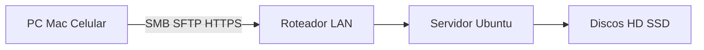

# Home Server — Documentação

Repositório de documentação aberta para configurar um **servidor caseiro** com base no **Ubuntu Server**. Os guias cobrem instalação, armazenamento, acesso remoto, organização de pastas, usuários com permissões restritas e exposição segura na internet.

**Versão de referência:** Ubuntu Server 24.04 LTS (Noble Numbat).

---

## O que é um servidor NAS?

**NAS** (*Network Attached Storage*, armazenamento conectado à rede) é um dispositivo ou computador na rede local cuja função principal é **armazenar e compartilhar arquivos** com outros equipamentos — computadores, smartphones, TVs — funcionando como uma nuvem privada dentro da própria rede.

### Como funciona

Um NAS permanece ligado ao roteador (em geral 24 horas por dia). Os clientes acessam os arquivos por protocolos como:

| Protocolo | Uso típico |
|-----------|------------|
| **SMB/CIFS** | Pastas de rede no Windows e macOS |
| **NFS** | Compartilhamento entre sistemas Linux/Unix |
| **SFTP** | Transferência segura via SSH |
| **Aplicações web** | Nextcloud, interfaces de painel (ex.: [CasaOS](documents/CASAOS.md)) |

### NAS dedicado vs servidor caseiro

| Tipo | Descrição |
|------|-----------|
| **Appliance NAS** (Synology, QNAP, TerraMaster) | Hardware e sistema operacional próprios, focados em discos, RAID e facilidade de uso. |
| **Servidor caseiro com Ubuntu** | PC comum ou mini PC com Ubuntu Server. Pode hospedar sites, jogos, painéis e **também** atuar como NAS — por exemplo na pasta `/srv/backup`. |

### Por que montar um servidor ou NAS em casa

- Backup centralizado de documentos e fotos
- Biblioteca de mídia acessível na rede local
- Sincronização de arquivos sem mensalidade de serviços em nuvem
- Controle total sobre onde os dados ficam armazenados

### Relação com esta documentação

Estes guias descrevem a montagem de um **servidor Ubuntu completo**, não apenas um NAS. A função de armazenamento em rede é um dos usos possíveis, documentado em conjunto com sites, servidores de jogos e outros serviços.

---

## Glossário rápido

| Sigla | Significado |
|-------|-------------|
| **NAS** | Network Attached Storage |
| **LVM** | Logical Volume Manager — gerenciamento flexível de partições no Linux |
| **SSH** | Secure Shell — acesso remoto seguro ao terminal |
| **DDNS** | Dynamic DNS — nome de domínio que acompanha IP dinâmico |
| **VPN** | Rede privada virtual — acesso remoto criptografado |
| **UFW** | Uncomplicated Firewall — firewall simplificado do Ubuntu |

---

## Documentação

### Trilha Ubuntu Server

Hub: **[Ubuntu Server](documents/UBUNTO_SERVER.md)** (`UBUNTO_SERVER.md`). Subdocumentos em `documents/ubuntu/`.

| Documento | Conteúdo |
|-----------|----------|
| [UBUNTO_SERVER.md](documents/UBUNTO_SERVER.md) | Visão geral, links oficiais e índice temático |
| [ubuntu/01-instalacao.md](documents/ubuntu/01-instalacao.md) | Download da ISO, pendrive bootável, instalação e particionamento de disco |
| [ubuntu/02-acesso-remoto.md](documents/ubuntu/02-acesso-remoto.md) | Acesso SSH via macOS (Terminal) e Windows (PowerShell) |
| [ubuntu/03-armazenamento-disco.md](documents/ubuntu/03-armazenamento-disco.md) | Diagnóstico e redimensionamento de disco (LVM e partições) |
| [ubuntu/04-pastas-e-servicos.md](documents/ubuntu/04-pastas-e-servicos.md) | Estrutura `/srv`, quatro cenários de uso, upload e download |
| [ubuntu/05-usuarios-e-permissoes.md](documents/ubuntu/05-usuarios-e-permissoes.md) | Criação de usuários e acesso restrito a pastas |
| [ubuntu/06-servidor-na-internet.md](documents/ubuntu/06-servidor-na-internet.md) | VPN, port forwarding, DDNS e segurança |

### Trilha CasaOS

Hub: **[CasaOS](documents/CASAOS.md)** — painel de nuvem pessoal ([site oficial](https://casaos.zimaspace.com/)). Subdocumentos em `documents/casaos/` (arquivos **separados** da trilha Ubuntu).

| Documento | Conteúdo |
|-----------|----------|
| [CASAOS.md](documents/CASAOS.md) | Visão geral e índice da trilha CasaOS |
| [casaos/01-instalacao.md](documents/casaos/01-instalacao.md) | Instalação do CasaOS no Ubuntu Server |
| [casaos/02-usuarios-e-permissoes.md](documents/casaos/02-usuarios-e-permissoes.md) | Usuários do painel e do Linux, permissões por pasta |
| [casaos/03-pastas-rede-e-mobile.md](documents/casaos/03-pastas-rede-e-mobile.md) | Samba, Mac, Windows, Android, iOS, transferência remota |
| [casaos/04-apps-recomendados.md](documents/casaos/04-apps-recomendados.md) | Apps essenciais na App Store |
| [casaos/05-acesso-sem-ip-fixo.md](documents/casaos/05-acesso-sem-ip-fixo.md) | mDNS, IP estático, Tailscale — sem depender do IP |
| [casaos/06-acesso-pela-internet.md](documents/casaos/06-acesso-pela-internet.md) | CasaOS e pastas remotas pela internet |

---

## Contribuição e uso

Esta documentação é escrita como **manual público**: exemplos (IPs, tamanhos de disco, nomes de usuário) são ilustrativos e devem ser adaptados a cada ambiente. Não substitui a [documentação oficial do Ubuntu Server](https://documentation.ubuntu.com/server/) nem o site do [CasaOS](https://casaos.zimaspace.com/).
