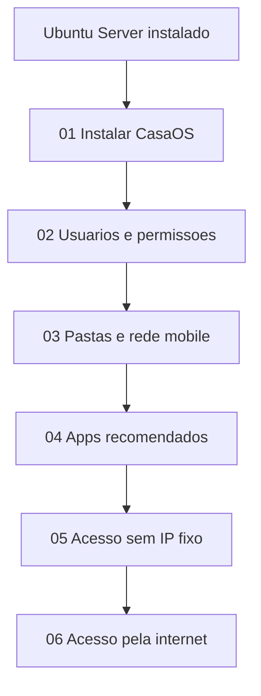

# CasaOS — Guia da nuvem pessoal

Este documento é o **hub da trilha CasaOS** — painel web open-source para gerenciar aplicativos Docker, arquivos e serviços em um servidor caseiro. Os tutoriais detalhados estão nos subdocumentos da pasta [`casaos/`](casaos/), **separados** da trilha [Ubuntu Server](UBUNTO_SERVER.md).

**Site oficial:** https://casaos.zimaspace.com/

Cada guia em `casaos/` explica **qual problema resolve**, **por que o fluxo funciona** e **como validar o resultado** — não apenas listas de comandos.

---

## O que é o CasaOS?

O [CasaOS](https://casaos.zimaspace.com/) é um sistema de nuvem pessoal baseado em **Docker**, com interface web para:

- Instalar aplicativos pela **App Store** (Nextcloud, Jellyfin, Syncthing, entre outros)
- Gerenciar arquivos no app **FILES**
- Executar apps customizados via Docker Hub
- Acessar o servidor na rede local (e remotamente, com configuração adequada)

O projeto é open-source (licença Apache 2.0). A IceWhale também desenvolve o **ZimaOS** como evolução da plataforma; este guia foca na instalação do **CasaOS sobre Ubuntu Server 24.04 LTS**.

### Instalação em uma linha

```bash
curl -fsSL https://get.casaos.io | sudo bash
```

Detalhes em [casaos/01-instalacao.md](casaos/01-instalacao.md).

---

## Pré-requisitos

| Requisito | Descrição |
|-----------|-----------|
| **Ubuntu Server** | Sistema base instalado e acessível na LAN |
| **Rede** | Servidor conectado ao roteador (cabo Ethernet recomendado) |
| **Espaço em disco** | Espaço suficiente para apps Docker e arquivos em `/srv/casaos/` |
| **Acesso administrativo** | Usuário com `sudo` no Ubuntu |

Se o Ubuntu Server ainda não estiver instalado, seguir primeiro a trilha [UBUNTO_SERVER.md](UBUNTO_SERVER.md) e os guias em [`ubuntu/`](ubuntu/) (trilha Ubuntu — **não** confundir com os arquivos em [`casaos/`](casaos/)).

---

## Links oficiais

| Recurso | URL |
|---------|-----|
| Site e documentação | https://casaos.zimaspace.com/ |
| Instalação | `curl -fsSL https://get.casaos.io \| sudo bash` |
| FAQ (porta WebUI, `casaos.local`, apps customizados) | Seção FAQ no site oficial |

---

## Índice dos guias (trilha CasaOS)

Os arquivos abaixo ficam em **`documents/casaos/`** — documentação **nova e independente** dos guias Ubuntu.

| # | Guia | Conteúdo |
|---|------|----------|
| 1 | [01-instalacao.md](casaos/01-instalacao.md) | Instalar CasaOS no Ubuntu Server, primeiro acesso ao painel |
| 2 | [02-usuarios-e-permissoes.md](casaos/02-usuarios-e-permissoes.md) | Conta do painel, usuários Linux, grupos e permissões por pasta |
| 3 | [03-pastas-rede-e-mobile.md](casaos/03-pastas-rede-e-mobile.md) | Pastas compartilhadas, Samba, Mac, Windows, Android, iOS, transferência remota |
| 4 | [04-apps-recomendados.md](casaos/04-apps-recomendados.md) | Apps essenciais na App Store e instalação customizada |
| 5 | [05-acesso-sem-ip-fixo.md](casaos/05-acesso-sem-ip-fixo.md) | Acesso sem digitar IP após reboot (mDNS, IP estático, Tailscale) |
| 6 | [06-acesso-pela-internet.md](casaos/06-acesso-pela-internet.md) | CasaOS e pastas de qualquer lugar (VPN, HTTPS, apps mobile) |

---

## Fluxo recomendado



---

## Estrutura de pastas sugerida

```
/srv/casaos/
├── compartilhado/    # Arquivos da família
├── fotos/            # Exemplo: segundo compartilhamento
├── convidado/        # Exemplo: acesso restrito
└── privado/          # Apenas administrador
```

Detalhes em [casaos/03-pastas-rede-e-mobile.md](casaos/03-pastas-rede-e-mobile.md).

---

## Voltar ao repositório

[README.md](../README.md) — índice geral (Ubuntu + CasaOS + NAS)
