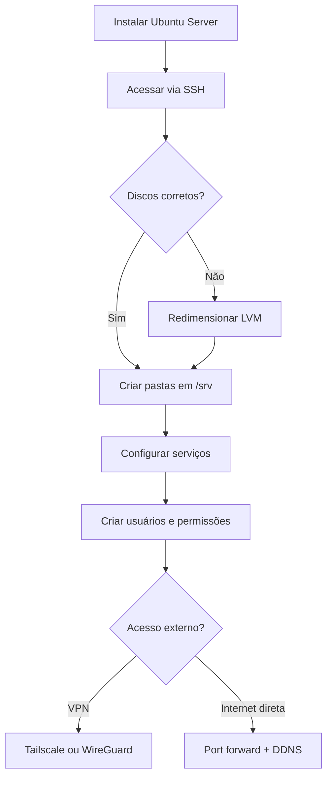

# Ubuntu Server — Guia do servidor caseiro

Este documento trata do **Ubuntu Server** (o nome do arquivo, `UBUNTO_SERVER.md`, é o índice deste repositório). Aqui estão a visão geral, os links oficiais e o índice dos guias detalhados.

**Versão de referência:** Ubuntu Server 24.04 LTS (Noble Numbat).

---

## O que é um servidor caseiro?

Um servidor caseiro é um computador dedicado, em geral ligado permanentemente à rede local, usado para hospedar serviços sem depender de provedores de nuvem pagos. Com Ubuntu Server instalado, essa máquina pode executar aplicações, armazenar arquivos e ser administrada remotamente via SSH.

---

## O que é possível fazer

| Uso | Descrição |
|-----|-----------|
| **Sites e APIs** | Hospedar aplicações web (ex.: PHP com MySQL/MariaDB) |
| **Servidores de jogos** | Minecraft, Valheim e outros dedicados |
| **Painel doméstico** | CasaOS e apps em contêineres |
| **Armazenamento / backup** | Nuvem privada, sincronização e cópias de segurança |
| **Mídia** | Biblioteca de vídeos e músicas (Plex, Jellyfin) |
| **Automação** | Scripts, CI local, DNS interno, monitoramento |

---

## Funcionalidades típicas do Ubuntu Server

- **SSH** — administração remota segura
- **UFW** — firewall simplificado
- **LVM** — particionamento flexível de discos
- **Samba / NFS** — compartilhamento de arquivos na rede
- **Nginx / Apache** — servidores web e reverse proxy
- **Docker** (opcional) — contêineres para apps e serviços
- **Atualizações automáticas** — `unattended-upgrades` para patches de segurança

---

## Links oficiais

| Recurso | URL |
|---------|-----|
| Download da ISO | https://ubuntu.com/download/server |
| Documentação oficial | https://documentation.ubuntu.com/server/ |
| Release notes 24.04 | https://wiki.ubuntu.com/NobleNumbat/ReleaseNotes |
| Notas de instalação | https://ubuntu.com/tutorials/install-ubuntu-server |

---

## Índice dos guias

Os tutoriais detalhados estão na pasta [`ubuntu/`](ubuntu/). Ordem sugerida de leitura:

| # | Guia | Conteúdo |
|---|------|----------|
| 1 | [01-instalacao.md](ubuntu/01-instalacao.md) | Download, pendrive bootável, instalação passo a passo, particionamento e cenário comum de disco (ex.: 100 GB de 500 GB) |
| 2 | [02-acesso-remoto.md](ubuntu/02-acesso-remoto.md) | Conexão SSH a partir do macOS (Terminal) e do Windows (PowerShell) |
| 3 | [03-armazenamento-disco.md](ubuntu/03-armazenamento-disco.md) | Diagnóstico de LVM/partições e redimensionamento do disco |
| 4 | [04-pastas-e-servicos.md](ubuntu/04-pastas-e-servicos.md) | Estrutura `/srv`, quatro cenários (web, jogos, CasaOS, backup), upload e download |
| 5 | [05-usuarios-e-permissoes.md](ubuntu/05-usuarios-e-permissoes.md) | Criação de usuários e acesso restrito a pastas específicas |
| 6 | [06-servidor-na-internet.md](ubuntu/06-servidor-na-internet.md) | Acesso externo via VPN (Tailscale/WireGuard) e port forwarding + DDNS |

### Trilha CasaOS (documentação separada)

Para instalar e operar o painel [CasaOS](https://casaos.zimaspace.com/) sobre este Ubuntu Server, utilizar o hub **[CASAOS.md](CASAOS.md)** e os guias em [`casaos/`](casaos/) — trilha independente da pasta [`ubuntu/`](ubuntu/).

---

## Estrutura de pastas sugerida

Após a instalação, os guias utilizam este layout como referência:

```
/srv/
├── web/       # Aplicações web (PHP, etc.)
├── games/     # Servidores de jogos
├── casaos/    # Dados e referência CasaOS
└── backup/    # Armazenamento tipo nuvem privada
```

Detalhes em [04-pastas-e-servicos.md](ubuntu/04-pastas-e-servicos.md).

---

## Fluxo recomendado



---

## Voltar ao índice principal

[README.md](../README.md) — visão geral do repositório, explicação sobre NAS e glossário.
