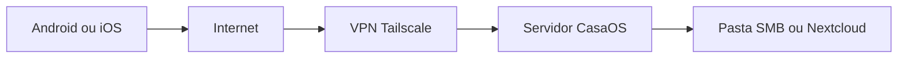

# Acesso ao CasaOS e pastas pela internet

Este guia descreve como acessar o **painel CasaOS** e as **mesmas pastas compartilhadas** de qualquer lugar, com conexão à internet — com ênfase em segurança (VPN e HTTPS) e passos para **Android** e **iOS** fora da rede de casa.

**Índice:** [CASAOS.md](../CASAOS.md) | Anterior: [05-acesso-sem-ip-fixo.md](05-acesso-sem-ip-fixo.md)

---

## Objetivo

Permitir administração remota do servidor e uso de arquivos (fotos, documentos, backups) sem estar na Wi-Fi doméstica — sem expor serviços inseguros como Samba diretamente na internet.

---

## Pré-requisitos

- CasaOS e Samba configurados ([01-instalacao.md](01-instalacao.md), [03-pastas-rede-e-mobile.md](03-pastas-rede-e-mobile.md))
- Compartilhamentos e usuários definidos ([02-usuarios-e-permissoes.md](02-usuarios-e-permissoes.md))
- Roteador com acesso à internet (CGNAT pode limitar port forwarding — ver seção 2)

---

## 1. O que NÃO fazer

| Serviço | Porta | Risco |
|---------|-------|-------|
| **Samba (SMB)** | 445 | Ataques ransomware, brute force — **nunca** expor na WAN |
| **SSH sem proteção** | 22 | Varredura constante na internet |

Preferir **VPN** ou apps com **HTTPS** (Nextcloud).

---

## 2. Visão geral das abordagens



| Necessidade | Abordagem recomendada |
|-------------|------------------------|
| Painel CasaOS remoto | Tailscale ou HTTPS + domínio |
| Pastas no celular fora de casa | **Nextcloud** ou **Tailscale + SMB** |
| Sync automático | Syncthing |

---

## 3. Opção A — Tailscale (recomendada)

Trata o celular e o servidor como se estivessem na mesma rede virtual, sem abrir portas no roteador.

### 3.1 Servidor

```bash
curl -fsSL https://tailscale.com/install.sh | sh
sudo tailscale up
```

Anotar IP Tailscale (ex.: `100.64.0.5`) no painel https://login.tailscale.com/admin/machines

### 3.2 Android

1. Instalar **Tailscale** na Play Store
2. Entrar com a mesma conta
3. Ativar VPN (interruptor ON)
4. **Painel CasaOS:** navegador → `http://100.64.0.5` (IP Tailscale do servidor)
5. **Pasta SMB:** Solid Explorer → SMB → host `100.64.0.5`, share `compartilhado`, usuário `familia`, senha Samba
6. Upload/download igual à LAN ([03-pastas-rede-e-mobile.md](03-pastas-rede-e-mobile.md))

### 3.3 iOS

1. Instalar **Tailscale** na App Store
2. Entrar na mesma conta; ativar VPN
3. **Painel CasaOS:** Safari → `http://100.64.0.5`
4. **Pasta SMB:** Arquivos → **Conectar ao Servidor** → `smb://100.64.0.5/compartilhado` → Registrado → credenciais Samba
5. Upload: Compartilhar → Salvar em Arquivos → pasta do servidor

### 3.4 Vantagens

- Funciona atrás de CGNAT
- Criptografia entre dispositivos
- Sem configurar port forwarding

---

## 4. Opção B — Nextcloud (melhor experiência mobile)

Ideal quando o uso principal for celular **fora de casa**, sem montar “pasta de rede”.

### 4.1 Instalar

Seguir [04-apps-recomendados.md](04-apps-recomendados.md).

### 4.2 Apenas na LAN (inicial)

- URL: `http://192.168.1.100:PORTA`
- Apps Android/iOS Nextcloud com essa URL na Wi-Fi de casa

### 4.3 Pela internet (HTTPS)

1. Instalar **Nginx Proxy Manager** via CasaOS
2. Registrar domínio DDNS (ex.: `meuserver.duckdns.org`)
3. Port forward **443** no roteador → servidor (se não usar só Tailscale)
4. Certificado Let's Encrypt no NPM
5. Proxy host: `nextcloud.meuserver.duckdns.org` → contêiner Nextcloud
6. No celular: app Nextcloud → URL `https://nextcloud.meuserver.duckdns.org`

### 4.4 Android fora de casa

1. Conectar à internet (4G/5G ou Wi-Fi externa)
2. Abrir app **Nextcloud**
3. Servidor já configurado com HTTPS
4. Login; aguardar sincronização
5. Upload: **+** → foto ou arquivo

### 4.5 iOS fora de casa

1. Abrir app **Nextcloud**
2. Login com HTTPS
3. Ativar **Disponível offline** em pastas críticas
4. Upload via **+** ou Compartilhar → Nextcloud

---

## 5. Opção C — Port forwarding + HTTPS (painel CasaOS)

Para expor o painel web publicamente (menos recomendado que VPN para uso pessoal).

1. Em CasaOS **Settings**, anotar ou alterar porta WebUI
2. Instalar Nginx Proxy Manager
3. DDNS (DuckDNS) apontando para IP público
4. `sudo ufw allow 443/tcp`
5. Roteador: encaminhar 443 → IP do servidor
6. Certificado SSL no NPM para `casaos.meuserver.duckdns.org`
7. Acessar `https://casaos.meuserver.duckdns.org` de qualquer lugar

> Alterar porta padrão e usar senha forte no painel. Considerar 2FA se disponível.

---

## 6. Opção D — WireGuard

VPN autogerenciada com controle total. Configuração no Ubuntu conforme documentação do WireGuard; clientes Android/iOS via app **WireGuard**.

Após conectar VPN, usar os mesmos passos SMB ou IP LAN do servidor na interface VPN.

---

## 7. Acessar a mesma pasta compartilhada — resumo

| Método | Android fora de casa | iOS fora de casa |
|--------|------------------------|------------------|
| **Tailscale + SMB** | Tailscale ON → Solid Explorer → `100.x.x.x` | Tailscale ON → Arquivos → `smb://100.x.x.x/share` |
| **Nextcloud** | App Nextcloud + HTTPS | App Nextcloud + HTTPS |
| **Syncthing** | App Syncthing (sync automático) | Não oficial no iOS — preferir Nextcloud |

A “mesma pasta” em SMB é `/srv/casaos/compartilhado` no servidor. No Nextcloud, mapear volume Docker para essa pasta ou subpasta na instalação.

---

## 8. Checklist de segurança

- [ ] VPN (Tailscale) ou HTTPS para acesso remoto
- [ ] Samba **não** exposto na porta 445 na internet
- [ ] Senhas fortes no painel CasaOS e Samba
- [ ] `sudo ufw enable` com regras mínimas
- [ ] Atualizações: `sudo apt update && sudo apt upgrade`
- [ ] Usuários de arquivo **sem** sudo
- [ ] Fail2ban para SSH se porta 22 estiver exposta:

```bash
sudo apt install -y fail2ban
sudo systemctl enable --now fail2ban
```

- [ ] Preferir chaves SSH em vez de senha para administração Ubuntu

Para conceitos gerais de exposição na internet (trilha Ubuntu), pode-se consultar também [06-servidor-na-internet.md](../ubuntu/06-servidor-na-internet.md) — o conteúdo deste arquivo é suficiente para o fluxo CasaOS.

---

## 9. Problemas comuns

| Problema | Solução |
|----------|---------|
| Tailscale conecta mas SMB falha | Verificar credenciais Samba; UFW permitir samba na interface tailscale0 se necessário |
| Nextcloud lento fora de casa | Link upload residencial limitado — normal |
| Port forward não funciona | CGNAT — usar Tailscale |
| Certificado HTTPS inválido | Verificar DNS e portas 80/443 para Let's Encrypt |

---

## Conclusão da trilha CasaOS

| Etapa | Guia |
|-------|------|
| Instalação | [01-instalacao.md](01-instalacao.md) |
| Usuários | [02-usuarios-e-permissoes.md](02-usuarios-e-permissoes.md) |
| Pastas e mobile | [03-pastas-rede-e-mobile.md](03-pastas-rede-e-mobile.md) |
| Apps | [04-apps-recomendados.md](04-apps-recomendados.md) |
| Sem IP fixo | [05-acesso-sem-ip-fixo.md](05-acesso-sem-ip-fixo.md) |
| Internet | Este documento |

[← Voltar ao hub CasaOS](../CASAOS.md) | [README do repositório](../../README.md)
