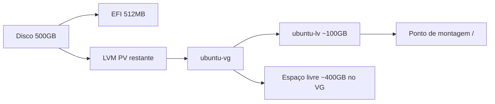

# Instalação do Ubuntu Server 24.04 LTS

Este guia descreve o processo completo: download da ISO, criação de pendrive bootável, instalação do sistema e configuração de armazenamento — incluindo o cenário comum em que apenas parte do disco é utilizada na instalação padrão.

**Pré-requisitos:**

- Computador x86_64 (64 bits) para o servidor
- Mínimo 2 GB de RAM (4 GB ou mais recomendado para vários serviços)
- Pendrive USB de 8 GB ou superior (será formatado)
- Cabo de rede (recomendado durante a instalação)
- Acesso a outro computador para baixar a ISO e gravar o pendrive

**Índice:** [UBUNTO_SERVER.md](../UBUNTO_SERVER.md) | Próximo: [02-acesso-remoto.md](02-acesso-remoto.md)

---

## 1. Download da ISO

1. Acesse https://ubuntu.com/download/server
2. Selecione **Ubuntu Server 24.04 LTS**
3. Baixe o arquivo `.iso` (aproximadamente 2–3 GB)

### Verificar integridade (recomendado)

Na página de download, copie o hash SHA256 publicado. No computador usado para o download:

**macOS / Linux:**

```bash
shasum -a 256 ubuntu-24.04.*-live-server-amd64.iso
```

**Windows (PowerShell):**

```powershell
Get-FileHash .\ubuntu-24.04.*-live-server-amd64.iso -Algorithm SHA256
```

O valor exibido deve coincidir com o hash oficial da Canonical.

---

## 2. Criar pendrive bootável

> **Atenção:** gravar a ISO apaga todos os dados do pendrive. Confirme a letra/nome do dispositivo antes de prosseguir.

### macOS

**Opção A — balenaEtcher (recomendado para iniciantes)**

1. Instale o [balenaEtcher](https://etcher.balena.io/)
2. Selecione a ISO baixada
3. Selecione o pendrive
4. Clique em **Flash**

**Opção B — linha de comando (`dd`)**

1. Identifique o dispositivo: `diskutil list`
2. Desmonte o pendrive (substitua `diskN` pelo identificador correto):

```bash
diskutil unmountDisk /dev/diskN
```

3. Grave a ISO (substitua `N` e o caminho da ISO):

```bash
sudo dd if=~/Downloads/ubuntu-24.04.*-live-server-amd64.iso of=/dev/rdiskN bs=4m status=progress
```

4. Ejeta: `diskutil eject /dev/diskN`

### Windows

**Opção A — Rufus**

1. Baixe o [Rufus](https://rufus.ie/)
2. Dispositivo: selecione o pendrive
3. Seleção de boot: escolha a ISO do Ubuntu Server
4. Esquema de partição: **GPT**
5. Sistema de destino: **UEFI (não CSM)**
6. Iniciar

**Opção B — balenaEtcher**

Mesmo fluxo descrito para macOS.

---

## 3. Iniciar a instalação no hardware

1. Conecte o pendrive ao servidor
2. Conecte monitor, teclado e cabo de rede (se disponível)
3. Ligue o equipamento e abra o menu de boot (teclas comuns: `F12`, `F2`, `Del`, `Esc` — varia conforme o fabricante)
4. Selecione boot pelo **USB**
5. Na tela inicial do instalador, escolha **Try or Install Ubuntu Server** (ou equivalente)

> **Secure Boot:** se a instalação falhar ao iniciar pelo USB, desative temporariamente o Secure Boot na BIOS/UEFI ou use uma ISO assinada compatível.

---

## 4. Passos do instalador

### 4.1 Idioma e teclado

| Tela | Ação sugerida |
|------|----------------|
| Language | Selecionar o idioma desejado (ex.: English ou Português, se disponível) |
| Keyboard | Layout correspondente ao teclado físico |

### 4.2 Tipo de instalação

| Opção | Quando usar |
|-------|-------------|
| **Ubuntu Server** | Instalação padrão com pacotes de servidor |
| Instalação minimizada | Apenas o essencial; pacotes adicionados depois via `apt` |

Para a maioria dos servidores caseiros, **Ubuntu Server** é a opção adequada.

### 4.3 Rede

| Situação | Configuração |
|----------|--------------|
| Cabo Ethernet conectado | Em geral o DHCP atribui IP automaticamente — anotar o endereço exibido |
| Sem cabo / Wi-Fi | Configurar após a instalação ou usar adaptador compatível |

IP estático e reserva no roteador são tratados em [06-servidor-na-internet.md](06-servidor-na-internet.md).

### 4.4 Proxy e mirror

- **Proxy:** deixar em branco em redes domésticas comuns
- **Mirror:** manter o mirror regional padrão, salvo necessidade específica

### 4.5 Armazenamento (parte crítica)

Esta etapa define como o disco será particionado. É a principal causa de “disco grande com pouco espaço usado pelo sistema”.

#### Opções do instalador

| Opção | Efeito |
|-------|--------|
| **Use an entire disk** | Utiliza um disco inteiro; com LVM ativado, cria volume group e volume lógico |
| **Custom storage layout** | Controle manual de partições, LVs e pontos de montagem |

Em instalações padrão com LVM no Ubuntu 24.04, o instalador pode criar um volume lógico `ubuntu-lv` com tamanho **fixo em torno de 100 GB**, mesmo em discos maiores (ex.: 500 GB). O espaço restante permanece **livre dentro do volume group** `ubuntu-vg` — não está perdido, mas não é usado até ser alocado.



#### Cenário A — LVM com volume lógico pequeno (comum)

- **Situação:** disco de 500 GB, sistema instalado em ~100 GB
- **Causa:** tamanho padrão do `ubuntu-lv` no instalador
- **O restante do disco:** espaço livre no `ubuntu-vg`, expansível depois
- **Solução:** [03-armazenamento-disco.md](03-armazenamento-disco.md)

#### Cenário B — Partição manual ou espaço não alocado

- Parte do disco formatada para `/` (ex.: 100 GB)
- Restante não formatado ou em partição separada
- **Uso alternativo:** montar em `/srv` ou `/data` para dados, sem expandir `/`

#### Como usar 100% do disco para o sistema (recomendado se um único SO ocupará o disco)

1. Selecionar **Use an entire disk** no disco desejado
2. Marcar **Set up this disk as an LVM group** (se disponível)
3. Abrir **Custom storage layout** ou editar o layout antes de confirmar
4. Selecionar o volume lógico `ubuntu-lv` e definir o tamanho para **ocupar todo o espaço livre** do volume group (ex.: ~500 GB em um disco de 500 GB)
5. Confirmar que o ponto de montagem `/` está associado a esse volume lógico

#### Como reservar parte do disco para dados separados

1. No layout customizado, criar um segundo volume lógico (ex.: `data-lv`) com o espaço restante
2. Definir ponto de montagem `/srv` ou `/data`
3. Vantagem: separação entre sistema operacional e arquivos de serviços
4. Desvantagem: gerenciamento de dois volumes em vez de um único expandido

> **Dica:** após a instalação, executar `df -h`, `sudo vgs` e `sudo lvs` para confirmar o espaço real disponível antes de copiar grandes volumes de dados.

### 4.6 Perfil do sistema

| Campo | Orientação |
|-------|------------|
| Nome do servidor | Hostname na rede local (ex.: `homeserver`) |
| Nome de usuário | Conta administrativa diária (evitar usar apenas `root`) |
| Senha | Senha forte; será usada para `sudo` e SSH |

### 4.7 Pacotes adicionais (Ubuntu 24.04)

Na tela **Featured Server Snaps** ou equivalente:

| Item | Recomendação |
|------|--------------|
| **Install OpenSSH server** | **Marcar** — essencial para acesso remoto ([02-acesso-remoto.md](02-acesso-remoto.md)) |
| Snaps (Docker, etc.) | Opcional; podem ser instalados depois conforme necessidade |

### 4.8 Finalizar

1. Revisar o resumo da instalação
2. Confirmar **Done** / **Install**
3. Aguardar a cópia dos pacotes e configuração
4. Quando solicitado, **reiniciar**
5. Remover o pendrive USB
6. Iniciar no disco interno

---

## 5. Primeiro acesso após a instalação

### Login local

Na console física do servidor, entrar com o usuário e senha criados na instalação.

### Verificações iniciais

```bash
# Endereço IP na rede
hostname -I

# Espaço em disco
df -h

# Volumes LVM (se LVM foi usado)
sudo vgs
sudo lvs

# Atualizar lista de pacotes
sudo apt update
```

### Se apenas ~100 GB aparecem em um disco de 500 GB

1. Verificar com `sudo vgs` se há espaço livre no volume group
2. Se houver, seguir [03-armazenamento-disco.md](03-armazenamento-disco.md) para expandir
3. Se não houver, revisar `lsblk` para espaço não particionado

---

## 6. Problemas comuns

| Problema | Possível causa | Ação |
|----------|----------------|------|
| Não inicia pelo USB | Ordem de boot incorreta | Verificar menu de boot e pendrive |
| Secure Boot bloqueia | Firmware restritivo | Desativar Secure Boot temporariamente |
| Disco não listado | Modo RAID/AHCI na BIOS | Ajustar modo SATA ou drivers |
| Rede sem IP | Cabo desconectado ou DHCP desativado | Conectar cabo; configurar IP estático no instalador |
| SSH indisponível após instalação | OpenSSH não marcado | `sudo apt install openssh-server` |

---

## Próximos passos

1. [02-acesso-remoto.md](02-acesso-remoto.md) — conectar via SSH a partir de outro computador
2. [03-armazenamento-disco.md](03-armazenamento-disco.md) — expandir disco, se necessário
3. [04-pastas-e-servicos.md](04-pastas-e-servicos.md) — organizar pastas em `/srv`

[← Voltar ao índice](../UBUNTO_SERVER.md)
